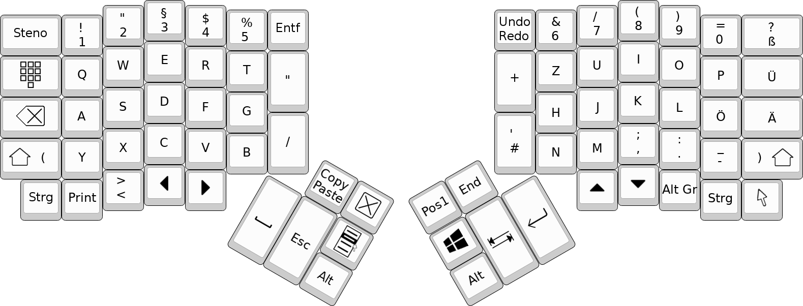
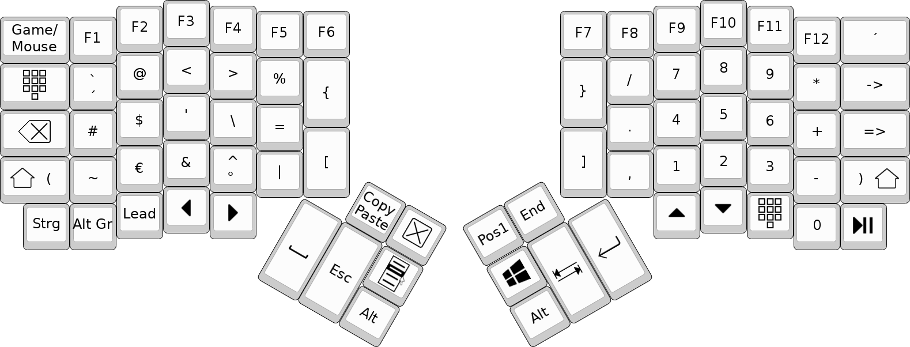
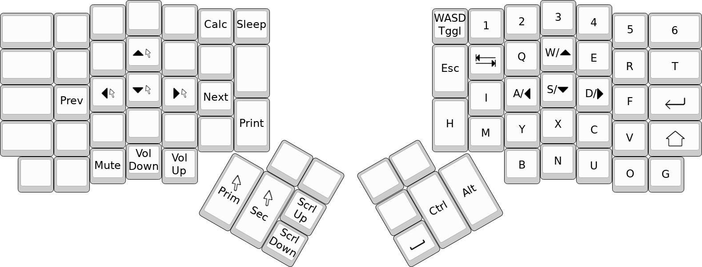

# Ergodox EZ keymap

This is the keymap for the [Ergodox EZ][ez] that I use.
It is based on a German keyboard layout, but it is tailored to my needs.

 [ez]: https://ergodox-ez.com

Base Layer:

Symbol Layer:

Mouse/Game Layer:

Special keys:
* The Copy/Paste key sends the copy command when held and sends the paste command when released.
* The key next to it closes the currently open window (Alt+F4).
* The Undo/Redo key undoes the last action when pressed and redoes it when held.
* The -> key sends "->" as a string on a German keyboard.
* The => key sends "=>" as a string on a German keyboard.
