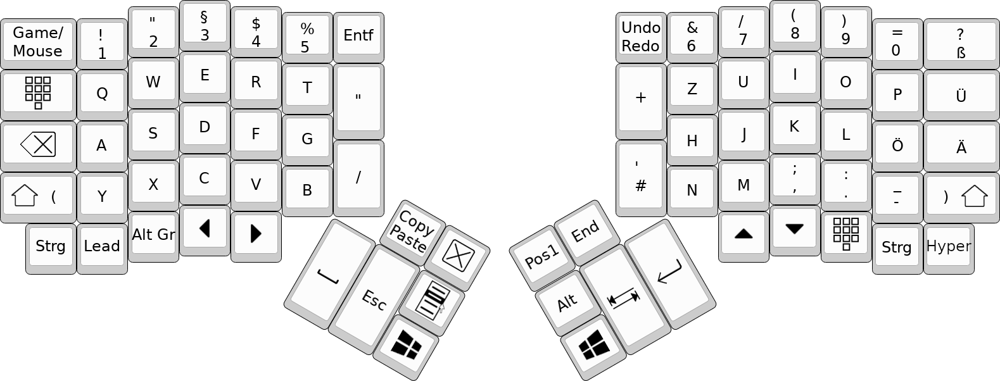

# Ergodox EZ keymap

This is the keymap for the [Ergodox EZ](https://ergodox-ez.com) that I use.
It is based on a German keyboard layout, but it is tailored to my needs.

## Building

To build it, you need the [qmk firmware](https://github.com/qmk/qmk_firmware/) and all of its build dependencies.

You can simply run

```sh
git clone https://github.com/qmk/qmk_firmware.git
cd qmk_firmware/keyboards/ergodox_ez/keymaps
git clone https://github.com/aticu/keymap.git aticu
cd aticu
```

to set everything up.

Afterwards you can use `make` to build the keymap or `make flash` to flash it to your keyboard.

## Layout

Base Layer:


Symbol Layer:


Mouse/Game Layer:


Gimp Layer:


To access the gimp layer, press "Lead" and then "G"

### Special keys

* The Copy/Paste key sends the copy command when held and sends the paste command when released.
* The key next to it closes the currently open window (Alt+F4).
* The Undo/Redo key undoes the last action when pressed and redoes it when held.
* The -> key sends "->" as a string on a German keyboard layout.
* The => key sends "=>" as a string on a German keyboard layout.
* The // key sends "//" as a string on a German keyboard layout.
* The /// key sends "///" as a string on a German keyboard layout.
* The \`\`\` key sends "\`\`\`" as a string on a German keyboard layout.
* The \` key sends "\`" directly on a German keyboard layout (it isn't a dead key).
* The ^ key sends "^" directly on a German keyboard layout (it isn't a dead key).
